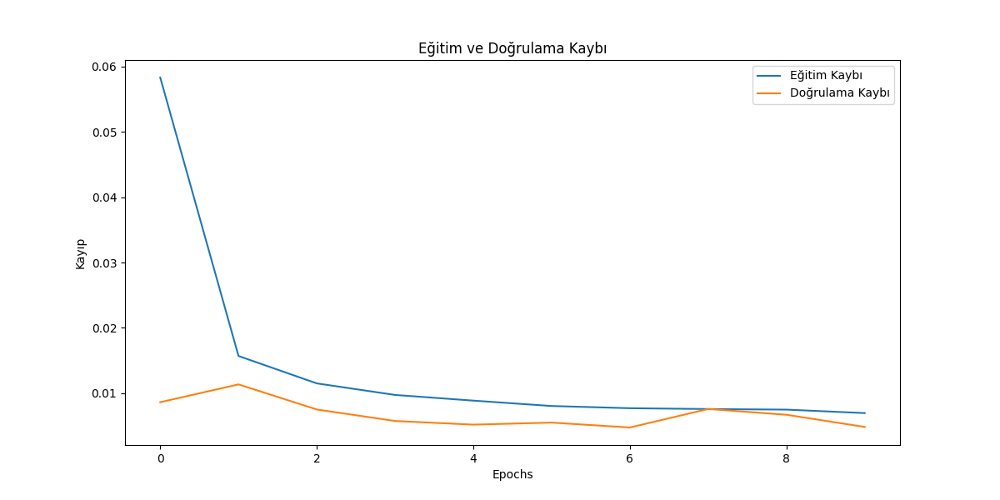
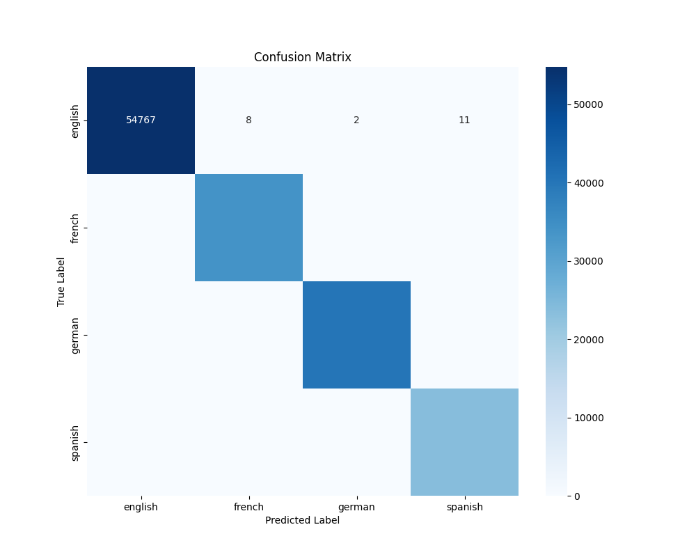
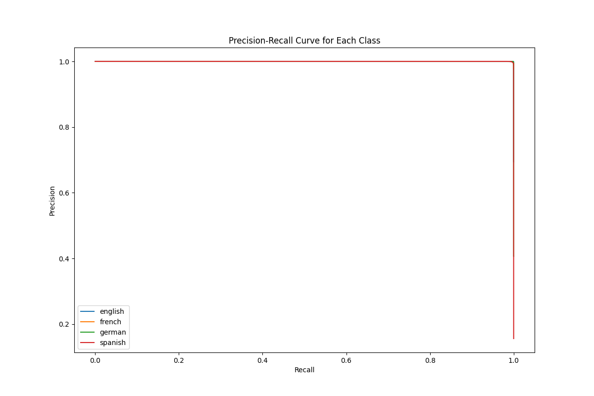

# Multi-Model Language Detection using RNN Architectures

This project focuses on identifying the language of a given text using various Deep Learning architectures. The study performs a comparative analysis between **BiLSTM**, **LSTM**, and **GRU** models to determine the most effective approach for sequential text data.

## 🚀 Key Features
* **Comparative Analysis:** Implementation and evaluation of three different RNN-based architectures.
* **High Performance:** Achieved an accuracy of **99.8%** with the BiLSTM model.
* **End-to-End Pipeline:** Includes data preprocessing, text vectorization, model training, and performance visualization.

## 📊 Dataset
The dataset used in this project consists of text samples from 22 different languages. 

* **Source:** [Language Detection Dataset (Kaggle)](https://www.kaggle.com/datasets/ishantjuyal/language-detection-dataset)
* **Structure:** `Text` (Input string), `Language` (Target label)

## 🛠️ Tech Stack
* **Language:** Python
* **Deep Learning:** TensorFlow, Keras
* **Data Processing:** Pandas, Numpy, Scikit-learn
* **Visualization:** Matplotlib, Seaborn

## 📈 Experimental Results

### 1. Model Performance Comparison
The following chart illustrates the performance metrics across different RNN architectures (BiLSTM, LSTM, GRU).

### 2. Confusion Matrix
The confusion matrix below shows the high precision of the BiLSTM model across 22 different languages.

### 3. Training History
The training and validation curves indicate a stable learning process without significant overfitting.

## 📝 Usage
1. Download the `languages.csv` from the Kaggle link above.
2. Update the `file_path` in the notebook.
3. Run the cells to train and compare the models.
